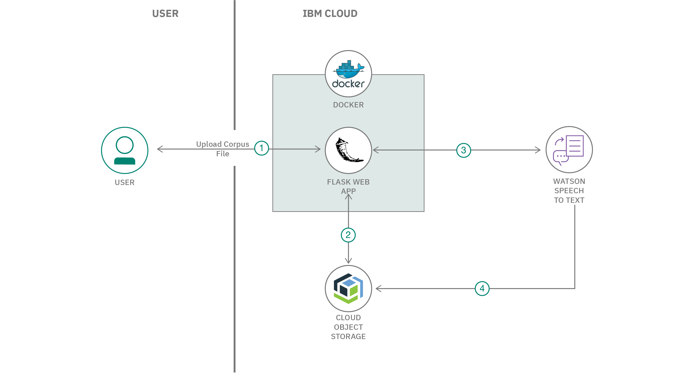

# Short Title

Build a custom Speech to Text model with diarization capabilites

# Long Title

Build custom Speech to Text model and transcribe audios to detect multiple speakers from the audio

# Author
* [Manoj Jahgirdar](https://www.linkedin.com/in/manoj-jahgirdar-6b5b33142/)
* [Manjula Hosurmath](https://www.linkedin.com/in/manjula-g-hosurmath-0b47031)

# URLs

### Github repo

* https://github.com/IBM/build-custom-stt-model-with-diarization

### Video Link
* https://www.youtube.com/watch?v=xgkYRJdBQ8E

# Summary

In this code pattern, given a corpus file and audio recordings of a meeting or classroom, we train custom language and acoustic speech to text model to transcribe audios to get diarized textual output. 

# Technologies

* [Python](https://developer.ibm.com/technologies/python): An open-source interpreted high-level programming language for general-purpose programming.

* [Object Storage](https://developer.ibm.com/technologies/object-storage): Store large amounts of data in a highly scalable manner.

# Description

This Code Pattern is part of the series [Extracting insights from Videos with IBM Watson]()

In the [previous code pattern](https://github.com/IBM/extract-audio-from-video), we learnt how to extract audio from video files and store the result in Cloud Object Storage. In this code pattern we will learn how to train custom language and acoustic speech to text models to transcribe audios and get diarized textual output, which we will be using for deriving insights.

Part of the World Health Organization's guidance on limiting further spread of COVID-19 is to practice social distancing. As a result, Companies in most affected areas are taking precautionary measures by encouraging Work from Home and Educational Institutes are closing their facilities. Employees working from home must be aware of the happenings in their company and need to collaborate with their team, students at home must be up to date with their education.

With the help of technology, employees can continue to collaborate and be involved into their work with virtual meetings, schools and teachers can continue to engage with their students through virtual classrooms. These meetings can be recorded and deriving insights from these recordings can be beneficial for the end users. Towards this goal, we will train custom language and acoustic speech to text model to transcribe audios to get diarized textual output which we will be using for deriving insights.

# Flow

<!--add an image in this path-->

1. User uploads corpus file to the application

2. The extracted audio from the [previous code pattern of the series](https://github.com/IBM/convert-video-to-audio) is retrived from Cloud Object Storage

3. The corpus file as well as the extracted audio are uploaded to Watson Speech To Text to train the custom model

4. The Downloaded audio file from the [previous code pattern of the series](https://github.com/IBM/convert-video-to-audio) is transcribed with the custom Speech To Text model and the text file is stored in Cloud Object Storage

# Instructions

> Find the detailed steps in the [README](https://github.com/IBM/build-custom-stt-model-with-diarization/blob/master/README.md) file.

1. Clone the repo

2. Create Watson Speech To Text Service

3. Add the Credentials to the Application

4. Deploy the Application

5. Run the Application

# Components and services

* [Speech to Text](https://cloud.ibm.com/catalog/services/speech-to-text): The Speech to Text service converts the human voice into the written word. It can be used anywhere there is a need to bridge the gap between the spoken word and their written form, including voice control of embedded systems, transcription of meetings and conference calls, and dictation of email and notes.

* [Object Storage](https://cloud.ibm.com/catalog/services/cloud-object-storage): IBM Cloud Object Storage is a highly scalable cloud storage service, designed for high durability, resiliency and security. Store, manage and access your data via our self-service portal and RESTful APIs. Connect applications directly to Cloud Object Storage use other IBM Cloud Services with your data.
